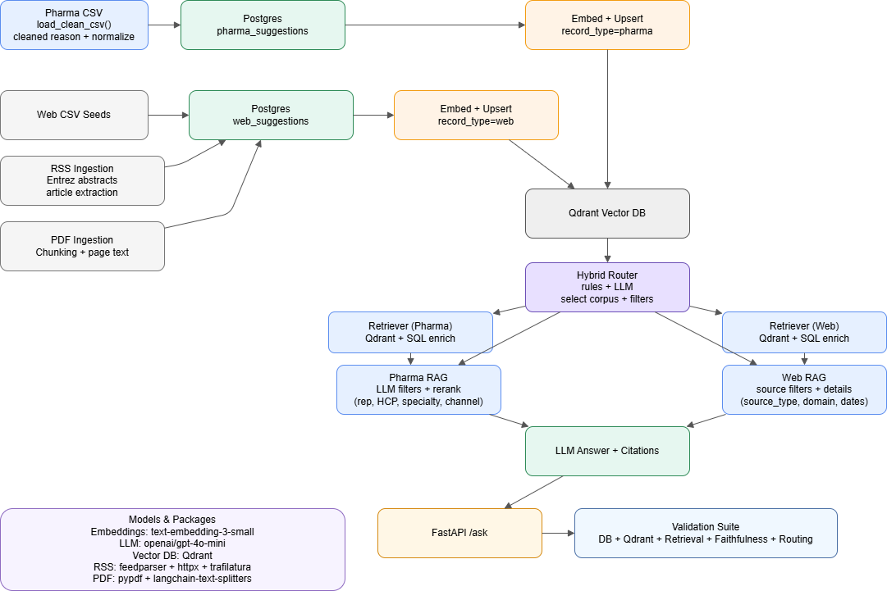

# RAG_PharmaChatBot

### _Conversational access to HCP engagement data with Retrieval-Augmented Generation and automated validation_

This project implements a **RAG-based conversational assistant** that enables pharmaceutical sales representatives to query HCP engagement data using natural language. The system focuses on accurate, grounded answers by coupling semantic retrieval with structured filters; validation exists as separate scripts and reports rather than a mandatory per-response gate. It primarily targets structured pharma suggestion data (CSV -> Postgres/Qdrant), with optional RSS/PDF ingestion, and aims to keep answers tied to retrieved records rather than free-form model assumptions.
Unique strength: the system preserves row-level provenance (one row = one engagement) and keeps that linkage end-to-end from ingestion through retrieval, making answers auditable back to specific source records.

Status: Data ingestion ✅ | Retrieval + RAG ✅ | API + UI ✅ | Validation ✅

## Architecture

```
CSV/Data Sources -> Ingestion -> Postgres/Supabase -> Qdrant Vector DB -> RAG Answer -> FastAPI/UI
                   (src/ingest/) (src/db/)        (src/retrieval/)    (src/retrieval/)
```

## End-to-End Process (Current)

1) Ingest CSV
   - src/ingest/csv_ingest.py parses raw CSV, normalizes columns, and creates:
     - row_id (stable hash)
     - document_text (used for embeddings)
     - suggestion_reason_clean (generic, data-driven de-templating)

2) Store in Postgres (Supabase)
   - src/db/create_tables.py ensures schema and indexes.
   - src/db/insert_csv.py inserts the cleaned data into public.pharma_suggestions.

3) Embed + Upsert to Qdrant
   - src/retrieval/embed_and_upsert.py reads from Postgres, embeds cleaned text, and upserts to Qdrant.
   - Payload contains key filter fields plus suggestion_reason_clean.

4) Query Parsing (LLM)
   - src/retrieval/rag.py uses an LLM to extract filters (rep, channel, specialty, product, dates, etc.).
   - Filters are normalized (channel synonyms, specialty expansion).

5) Retrieval
   - src/retrieval/retriever.py applies filters inside Qdrant, then ranks by semantic similarity.
   - Optional re-ranking by suggestion_reason_clean.

6) Answer Generation
   - src/retrieval/rag.py builds a context from retrieved rows and generates a response.
   - Output shaping supports: HCP name, specialty, product switch fields, and short reason summaries.


## Flow Chart (draw.io)

Open the diagram file in VS Code (Draw.io Integration) or diagrams.net:


 

## Project Goals

- Ingest structured pharma sales suggestion data (CSV -> SQL)
- Preserve row-level semantics (one row = one interaction / suggestion)
- Prepare the data for hybrid retrieval:
  - SQL filtering (rep, HCP, product, channel, value)
  - Vector search (semantic "why", reasoning, context)
- Support future on-the-fly external augmentation (RSS / web / medical sources)

## Project Structure

```
RAG_PharmaChatBot/
|-- src/
|   |-- config/
|   |   `-- settings.py        # Pydantic Settings for all env vars
|   |-- db/
|   |   |-- supabase.py        # SQLAlchemy engine factory
|   |   |-- create_tables.py   # Schema definition (public.pharma_suggestions)
|   |   `-- insert_csv.py      # CSV -> Postgres ingestion
|   |-- ingest/
|   |   |-- csv_ingest.py      # Strict CSV parser (handles embedded newlines)
|   |   |-- rss_ingest.py      # RSS/Atom fetch + normalization for web ingestion
|   |   `-- pdf_ingest.py      # PDF ingestion + chunking
|   |-- retrieval/
|   |   |-- rag.py             # Qdrant retriever + LLM chain
|   |   `-- retriever.py       # Retrieval functions (pharma + web)
|   `-- api/
|       `-- main.py            # FastAPI Q&A endpoints
|-- data/input/
|   `-- REP_HCP_interaction_suggestions.csv
|-- scripts/
|   |-- run_ingest_csv.ps1     # (planned) PowerShell ingestion wrapper
|   |-- run_rss_pipeline.ps1   # RSS fetch + insert + embed
|   |-- test_web_query.py      # Quick web retrieval test
|   |-- validate_all.py        # Single validation report
|   |-- validate_ingest.py     # CSV ingest validation
|   |-- validate_faithfulness.py # LLM grounding check
|   `-- validate_routing.py    # Routing accuracy check
|-- src/db/
|   |-- insert_rss.py          # RSS/Atom -> Postgres ingestion
|   |-- insert_web_csv.py      # Web CSV -> Postgres ingestion
|   `-- insert_pdf.py          # PDF -> Postgres ingestion
|-- ui/
|   `-- app.py                 # Streamlit UI
|-- docs/
|   `-- rag_pharma_flow.drawio # Flow chart (draw.io)
|-- .env                       # Local credentials (not in git)
|-- .env.example               # Template for .env
|-- requirements.txt           # Python dependencies
`-- README.md                  # This file
```

## Key Components

- src/config/settings.py: Pydantic Settings class for all env vars.
- src/db/supabase.py: SQLAlchemy engine factory.
- src/db/create_tables.py: Schema for public.pharma_suggestions and indexes.
- src/ingest/csv_ingest.py: CSV parser, schema validation, suggestion_reason_clean, row_id, document_text.
- src/db/insert_csv.py: Main ingestion script (CSV -> Postgres).
- src/retrieval/retriever.py: Filtered vector search in Qdrant.
- src/retrieval/rag.py: LLM filter parsing + RAG answer generation.

## Quick Start

### 1) Environment Setup

```powershell
cp .env.example .env
```

Update .env with:
- SUPABASE_DB__HOST, SUPABASE_DB__PORT, SUPABASE_DB__NAME, SUPABASE_DB__USER, SUPABASE_DB__PASSWORD
- QDRANT__URL, QDRANT__API_KEY, QDRANT__COLLECTION
- OPENROUTER__API_KEY, OPENROUTER__API_URL

### 2) Ingestion Pipeline

```powershell
python -m src.db.supabase
python -m src.db.create_tables
python -m src.db.insert_csv
```

### 3) Embeddings + Qdrant

```powershell
python -m src.retrieval.embed_and_upsert
```

Options:
- `--pharma` (default) embeds `public.pharma_suggestions`
- `--web` embeds `public.web_suggestions`

### 4) Web/RSS Ingestion

1) Ensure tables are created:

```powershell
python -m src.db.create_tables
```

2) Fetch RSS feeds and insert into `public.web_suggestions`:

```powershell
python -m src.db.insert_rss
```

3) Embed web content into Qdrant:

```powershell
python -m src.retrieval.embed_and_upsert --web
```

4) Customize feeds:
   - Edit `src/ingest/rss_ingest.py` and update `DEFAULT_FEEDS`.

5) Quick retrieval test:

```powershell
python scripts/test_web_query.py
```

Notes:
- PubMed RSS is enriched with abstracts via NCBI E-utilities when a PubMed ID is detected.
- Set `ENTREZ_EMAIL` in `.env` for NCBI usage.

### 5) Web CSV Ingestion

If you already have a web/RSS CSV (e.g., `data/input/pharma_external_sources_seed.csv`):

1) Set `WEB_CSV_INPUT_PATH` in `.env`
2) Run:

```powershell
python -m src.db.insert_web_csv
python -m src.retrieval.embed_and_upsert --web
```

### 6) PDF Ingestion

1) Place PDFs in `PDF_INPUT_PATH` (default `./data/pdf`).
2) Run:

```powershell
python -m src.db.insert_pdf
python -m src.retrieval.embed_and_upsert --web
```

## Developer Patterns

- Use Pydantic Settings singleton (src/config/settings.py).
- All DB operations use SQLAlchemy get_engine().
- CSV parsing handled only by load_clean_csv().

## Filtered Vector Search (Implementation Details)

The filtered vector search happens in `src/retrieval/retriever.py`:

1) **Filter construction**
   - Filters are built from parsed query fields (rep, channel, specialty, product, date range).
   - Each filter becomes a Qdrant `FieldCondition` and is passed as `query_filter`.
   - Date filters use `DatetimeRange` on `suggestion_date`.

2) **Indexing for filters**
   - `create_payload_index` is called for each filterable key.
   - Keyword fields use `PayloadSchemaType.KEYWORD`.
   - `suggestion_date` uses `PayloadSchemaType.DATETIME`.

3) **Vector search**
   - The query is embedded using the same embedding model used for ingestion.
   - Qdrant returns top-K points by similarity **after** applying the filters server-side.
   - This is implemented via `search()` or `query_points()` depending on the client version.

4) **DB enrichment**
   - Each Qdrant point is mapped to its full row from Postgres.
   - The retrieved rows are returned with a `similarity_score` for each result.

Code references:
- `src/retrieval/retriever.py` (search_suggestions)
- `src/retrieval/qdrant_client.py` (client creation)
- `src/retrieval/embed_and_upsert.py` (embedding + upsert)

## Web/RSS Retrieval

Use `search_web_suggestions()` for web/RSS content:
- Filters: `source_type`, `source`, `domain`, `content_type`, `tags`, `published_from`, `published_to`.
- Enforced payload filter: `record_type = "web"`.

Code references:
- `src/retrieval/retriever.py` (`search_web_suggestions`, `search_web_best_match`)

## Hybrid Router

Use `answer_with_router()` to automatically route queries to pharma or web:
- Rules first (keywords like HCP/rep/channel vs FDA/news/publications).
- LLM fallback if ambiguous (model: `openai/gpt-4o-mini`).

Example:

```python
from src.retrieval.rag import answer_with_router

resp = answer_with_router(
    query="What are recent findings about ocrelizumab in multiple sclerosis?",
    limit=5,
    score_threshold=0.6,
    source_type="rss_article",
    debug=True,
)

print(resp.route_used)
print(resp.answer)
```

Code references:
- `src/retrieval/rag.py` (`route_query`, `answer_with_router`)

## API Layer

Start the API:

```powershell
python -m uvicorn src.api.main:app --host 0.0.0.0 --port 8000
```

Auth and rate limits (set in `.env`):
- `API_KEY` (optional; if set, send `x-api-key` header)
- `API_RATE_LIMIT` (default `20/minute`)

Example request:

```bash
curl -X POST http://localhost:8000/ask \
  -H "Content-Type: application/json" \
  -H "x-api-key: YOUR_KEY" \
  -d "{\"query\":\"What are recent findings about ocrelizumab in multiple sclerosis?\",\"limit\":5,\"include_source_details\":true}"
```

## Simple UI

Start the API:

```powershell
python -m uvicorn src.api.main:app --host 0.0.0.0 --port 8000
```

In a new terminal, run the Streamlit UI:

```powershell
python -m streamlit run ui/app.py
```

Optional environment variables:
- `API_URL` (default `http://localhost:8000/ask`)
- `API_KEY` (if your API is protected)

### UI Controls (Streamlit)

- `Limit`: number of results to retrieve.
- `Score Threshold`: minimum similarity score to include.
- `Source Type`: `auto`, `rss_article`, `seed`, `pdf`.
- `Show Sources`: include source details in the response.
- `Explain If Empty`: return an explanation when no results are found.
- `Show Filters`: display parsed/normalized filters used for retrieval.

## Monitoring & QA

- Requests are logged to `logs/api_requests.jsonl`.
- Each record includes query, route, latency, and citations.

## CI + Tests

Run smoke tests:

```powershell
pytest -q
```

Schema check:

```powershell
python scripts/schema_check.py
```

## Ingestion Validation

Run a basic validation report on CSV inputs:

```powershell
python scripts/validate_ingest.py
```

Reports are written to `logs/validation_report_*.json` and bad rows are saved under `data/quarantine/`.

## Validation Suite

Run all validations and get a single summary file:

```powershell
python scripts/validate_all.py
```

## Models & Packages (Retrieval)

Core models:
- Embeddings: `text-embedding-3-small` via OpenRouter
- LLM: `openai/gpt-4o-mini` via OpenRouter

Retrieval stack:
- Vector DB: Qdrant
- SQL: Postgres/Supabase

Ingestion utilities:
- RSS: `feedparser`, `httpx`, `trafilatura`
- PDFs: `pypdf`, `langchain-text-splitters` (RecursiveCharacterTextSplitter)
## Optional Re-Ranker (Implementation Details)

The optional re-ranker is in `src/retrieval/rag.py`:

1) **Candidate pool**
   - A larger pool is retrieved from Qdrant (`limit * rerank_pool_multiplier`).

2) **Reason-focused scoring**
   - Reranking uses `suggestion_reason_clean` when available.
   - It computes semantic similarity between the query and `suggestion_reason_clean`.
   - It also computes lexical overlap and phrase-anchor bonuses to favor distinctive matches.

3) **Final ordering**
   - Results are sorted by the hybrid rerank score.
   - The top `limit` results are kept for answer generation.

### Re-Ranker Scoring Details (Step-by-Step)

All logic lives in `src/retrieval/rag.py` in `_rerank_by_suggestion_reason()`.

1) **Inputs**
   - `query`: user query (or the reduced reason-only query).
   - `results`: retrieved rows with `suggestion_reason_clean` or `suggestion_reason`.

2) **Normalization**
   - `_normalize_text()` collapses whitespace and trims.
   - Each row gets a `reason` string from `suggestion_reason_clean` if present, else `suggestion_reason`.

3) **Semantic similarity**
   - Uses `get_embeddings()` for the query and all reasons in one batch.
   - Computes cosine similarity between the query embedding and each reason embedding.
   - Stored as `reason_similarity_score`.

4) **Lexical overlap**
   - `_lexical_score()` computes token overlap:
     - Extracts alphabetic tokens from query and reason.
     - Score = |intersection| / |query_tokens|.
   - Stored as `reason_lexical_score`.

5) **Bonus signals**
   - **Exact substring bonus**: `+0.2` if cleaned query is a substring of reason.
   - **Fuzzy ratio bonus**: `+0.25 * SequenceMatcher(query, reason).ratio()`.
   - **Keyword overlap bonus**: `+0.25 * overlap_fraction` using distinctive query keywords.
   - **Strong match bonus**: `+0.5` if keyword overlap >= 0.6 and at least 4 keywords.
   - **Phrase anchor bonus**: build 2-4 word phrases from query tokens; `+0.5` if 1 hit, `+1.5` if 2+ hits.

6) **Final hybrid score**
   - `reason_hybrid_score = 0.3 * semantic_similarity + 0.7 * lexical_overlap + bonuses`

7) **Sorting**
   - Results are sorted descending by `reason_hybrid_score` and returned.

Code references:
- `src/retrieval/rag.py` (`answer_with_rag`, `_rerank_by_suggestion_reason`)

## Current Capabilities

- Pharma CSV ingestion + semantic retrieval
- Web/RSS ingestion + PubMed abstract enrichment
- PDF ingestion with chunking
- Hybrid router (pharma/web/multi)
- FastAPI `/ask` endpoint + Streamlit UI
- Validation suite (DB/Qdrant/Retrieval/Faithfulness/Routing)


